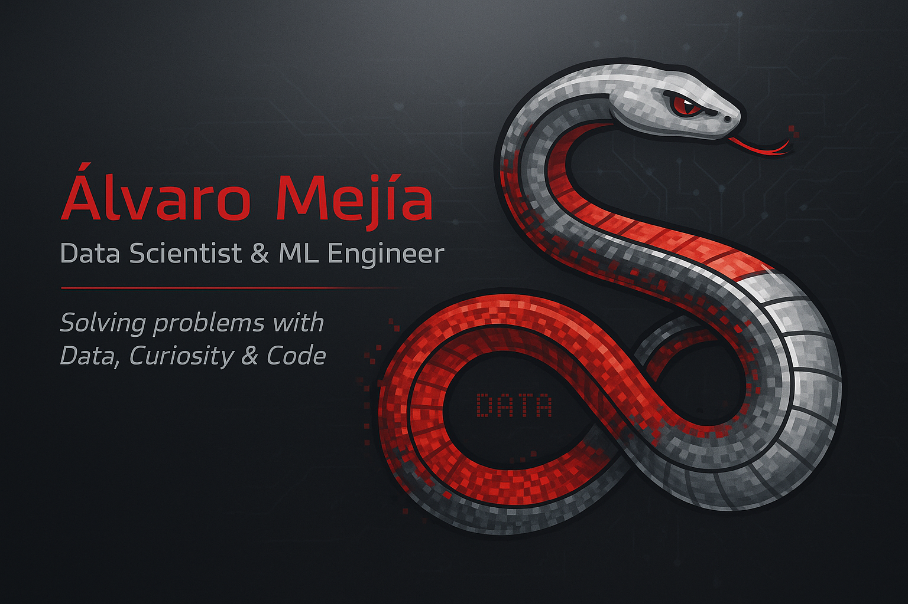

<h1 align="center">Hello, I'm <a href="https://linktr.ee/mgalvaro">Álvaro</a> 👋</h1>

## 🤓 About me

- ✈️ I've studied Aerospace Engineering. I'm from Spain, but living and working in Poland.
- 📚 I'm currently diving into the Data Science and AI world.
- 🐍 Programing in Python and using SQL.
- 📝 Collecting data from databases and using web scraping.
- 🔧 Performing Feature Engineering on data
- 📊 Building Dashboards and Data Visualizations with Streamlit.
- 🧠 Developing Machine Learning models & Neural Networks.
- ⚡ Harry Potter fan, 🤘 metalhead and 🐈🐈‍⬛ cat dad.

 

## <b> Skills</b>

<!-- Languages -->
<h3>Languages</h3>
<table border="1" cellspacing="0" cellpadding="5">
  <tr>
    <td>Languages</td>
    <td>
      
      
      
      
    </td>
  </tr>
</table>

<!-- Python Libraries -->
<h3>Python Libraries</h3>
<table border="1" cellspacing="0" cellpadding="5">
  <tr>
    <td>🧮 Data Manipulation & Analysis</td>
    <td>
      
      
    </td>
  </tr>
  <tr>
    <td>📊 Data Visualization</td>
    <td>
      
      
      
    </td>
  </tr>
  <tr>
    <td>🤖 Machine Learning & Deep Learning</td>
    <td>
      
      
    </td>
  </tr>
  <tr>
    <td>🕸️ Web Scraping</td>
    <td>
      
      
      
    </td>
  </tr>
  <tr>
    <td>🌐 Data Access / Database Connectors</td>
    <td>
      
      
    </td>
  </tr>
  <tr>
    <td>🌍 Geospatial / Maps</td>
    <td>
      
    </td>
  </tr>
  <tr>
    <td>📱 App / Dashboard Development</td>
    <td>
      
      
    </td>
  </tr>
  <tr>
    <td>📦 Big Data</td>
    <td>
      
    </td>
  </tr>
  <tr>
    <td>🧠 NLP (Natural Language Processing)</td>
    <td>
      
    </td>
  </tr>
</table>

<!-- Tools -->
<h3>Softwares and Tools</h3>
<table border="1" cellspacing="0" cellpadding="5">
  <tr>
    <td>Version Control / IDE / Notebook</td>
    <td>
      
      
      
      
    </td>
  </tr>
</table>

 

## 🔗 Let's connect

<!--
**mgalvaro/mgalvaro** is a ✨ _special_ ✨ repository because its `README.md` (this file) appears on your GitHub profile.

Here are some ideas to get you started:

- 🔭 I’m currently working on ...
- 🌱 I’m currently learning ...
- 👯 I’m looking to collaborate on ...
- 🤔 I’m looking for help with ...
- 💬 Ask me about ...
- 📫 How to reach me: ...
- 😄 Pronouns: ...
- ⚡ Fun fact: ...
-->
